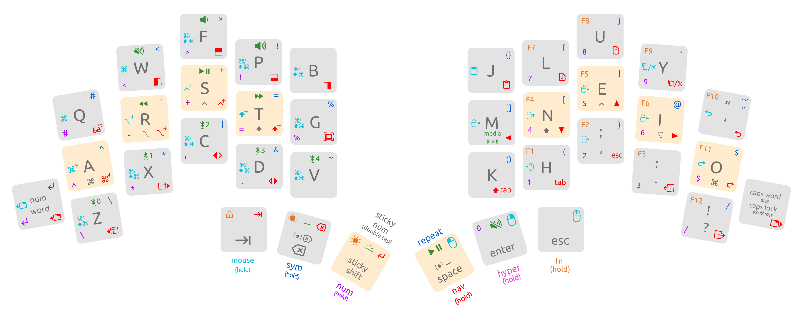

<picture>
  <source media="(prefers-color-scheme: dark)" srcset="/docs/images/TOTEM_logo_dark.svg">
  <source media="(prefers-color-scheme: light)" srcset="/docs/images/TOTEM_logo_bright.svg">
  
</picture>

# CUSTOM ZMK CONFIG FOR THE TOTEM SPLIT KEYBOARD

[Here](https://github.com/GEIGEIGEIST/totem) you can find the hardware files and build guide created by GEIST.

TOTEM is a 38 key column-staggered split keyboard running [ZMK](https://zmk.dev/) or [QMK](https://docs.qmk.fm/). It's meant to be used with a SEEED XIAO BLE or RP2040.

## Cosmic's Keymap

The keymap contains 7 layers:
### Colemak base layer
  - Home row mods mirrored on both hands, command, alt, control, shift from pinky to index
  - `space`, `backspace`, `tab`, `enter`, `sticky shift` and `esc` on thumbs
  - num-word and caps-word on outer pinky keys
  - shift+tap space for underscore, shift+tap backspace for delete
  - All thumb keys allow access to other layers on holds
### Navigation layer
  - accessible via right home thumb key (`space`)
  - places arrows, tab, esc and clipboard controls on the right hand, spectacle controls, sticky mods and app/window switchers on the left
  - previous and next tab macros (`gt/gT`) for vim/vimium on the outer pinky keys
  - unlocks repeated keypresses on left thumb holds
### Symbol layer
  - accessible via second left thumb key (`backspace`)
  - places brackets, macros for autopairs and most vim-relevant symbols on the right hand
  - left hand symbols are optimized for combinations with `=` that roll inward toward index finger
### Number layer
  - accessible via left home thumb key (`sticky shift`), num-word toggle on left outer pinky, or as a sticky layer via a double tap on sticky shift
  - places a num pad on the right hand with 0 on right thumb
  - right hand pinky is a command/`$` hold/tap, other home keys in the num pad drop their home row mods
  - left hand includes most symbols that are often combined with numbers
    - nearly the same as the sym layer left hand, but puts `,` and `.` on the left hand in place of `|` and `&` , since comma and dot on the right hand are covered by the num pad
  - double tapping space on the num layer outputs comma + space
### Function layer
  - accessible via third right thumb key (`esc`)
  - places function keys on the right hand in the same layout as the num layer
  - places brightness controls and screen lock on the left thumb cluster
### Mouse layer
  - accessible via third left thumb key (`tab`)
  - places mouse movement and scroll controls on the right hand along with same clipboard controls as nav layer
  - includes home row mod keys and hold/taps for command shortcuts on the left hand for easy one handed usage
### Mod/Media layer
  - accessible through a hold on `M`
  - places media controls on left home row and right thumb cluster
  - includes controls for switching and clearing bluetooth profiles
### Hyper Key
  - accessible through second right thumb key (`enter`)
  - equivalent to holding down all four mods at once, handy for alfred shortcuts

## How to use this keymap

- fork this repo
- `git clone` your repo, to create a local copy on your PC (you can use the [command line](https://www.atlassian.com/git/tutorials) or [github desktop](https://desktop.github.com/))
- adjust the totem.keymap file (find all the keycodes on [the zmk docs pages](https://zmk.dev/docs/codes/))
- `git push` your repo to your fork
- on the GitHub page of your fork navigate to "Actions"
- scroll down and unzip the `firmware.zip` archive that contains the latest firmware
- connect the left half of the TOTEM to your PC, press reset twice
- the keyboard should now appear as a mass storage device
- drag'n'drop the `totem_left-seeeduino_xiao_ble-zmk.uf2` file from the archive onto the storage device
- repeat this process with the right half and the `totem_right-seeeduino_xiao_ble-zmk.uf2` file.